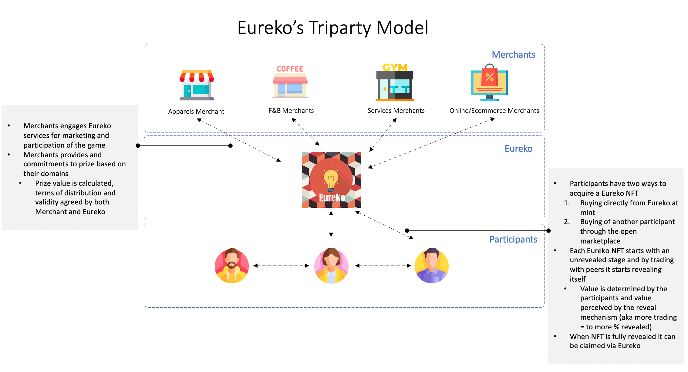
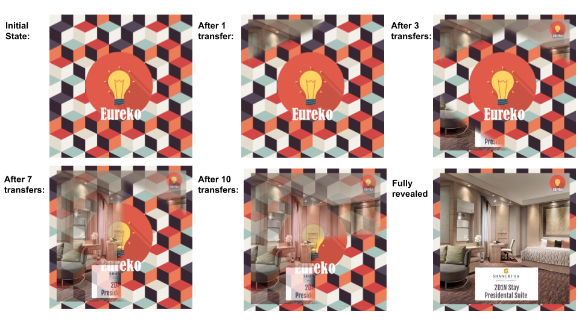
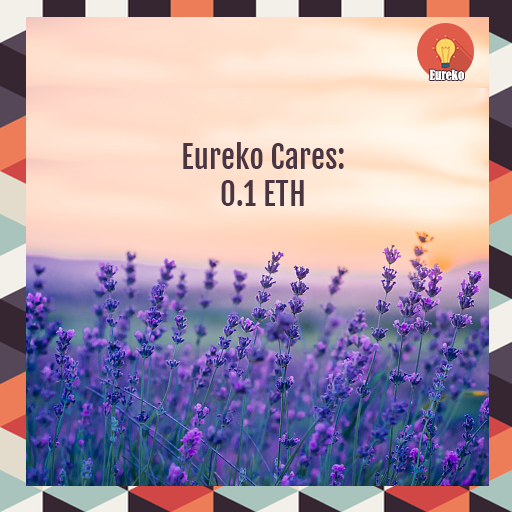
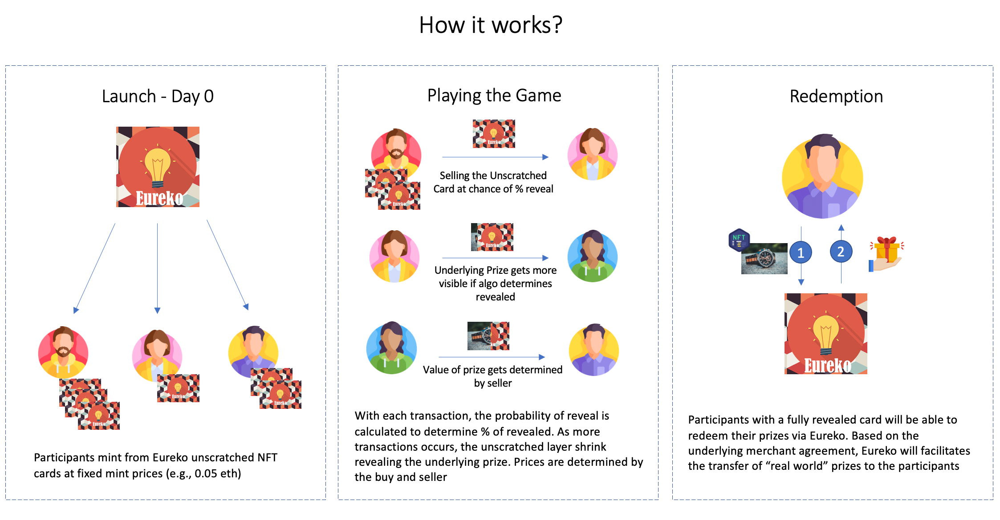
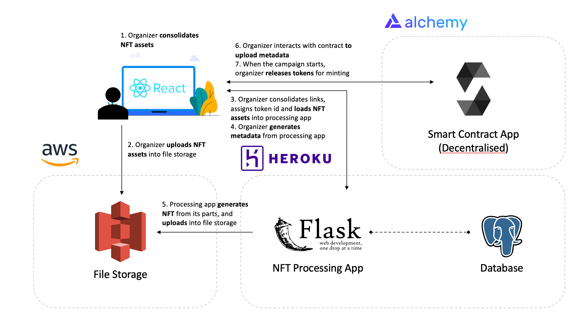
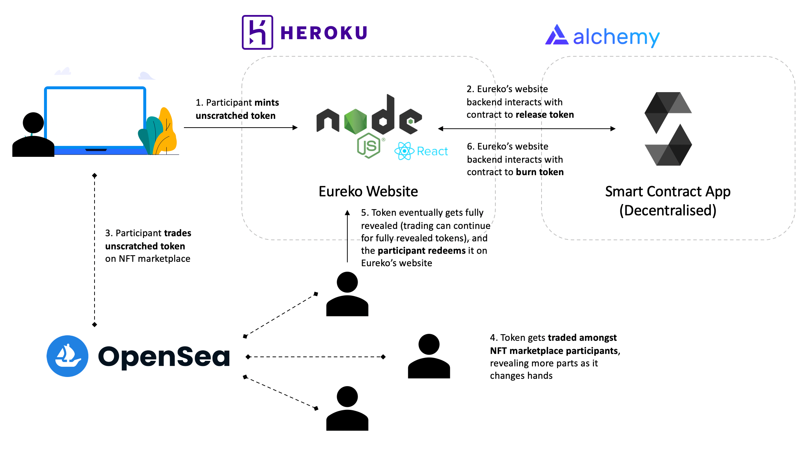

# Eureko - Web 3.0 Hype Marketing using NFTs

> Driving hype marketing through games

## Introduction

With increasing accountability and visibility, web3 games are changing the landscape of how games are played and perceived. Implementing web3 mechanics to non web3 games will not be straightforward of just introducing NFTs. These games must be thought-out and put emphasis into the users’ experience with benefits. Thus, all parties can benefit from this by driving adoption and changing attitudes towards NFTs. 

Through our thorough research, we found that there is a gap between IRL brands and the Web3 space which could benefit greatly from the use of P2E games. 

Eureko establishes the bridge between in-real-life brands to their consumers by onboarding them into the blockchain space. The game of marketing has been dynamically evolving. Through leveraging Eureko's technology, trust and community’s strength, brands can utilize our concept as a new form of marketing channel to grow their brand awareness and reach new audiences.

## Market Analysis

### Challenges in Marketing and Raising Brand Awareness

According to the statistics from the Small Business Association, over 627,000 new businesses open each year in the US. However, 20% of these fail within the first year, and this escalates to almost half by the first 5 years. In such a competitive landscape, having effective marketing and brand awareness strategies are crucial for businesses, especially small businesses, to differentiate themselves from their competitors and increase their chances at success. But this does not come cheap. Effective strategies require investing a substantial amount of capital and human resources into crafting, planning and implementing them. This problem is exacerbated by rising digital ad costs in recent years, which smaller businesses may struggle to afford while juggling other pressing issues.

### Gamification-based marketing

Gamification-based marketing is a technique where gaming elements are incorporated into more traditional marketing techniques, such as playable ads. Such an approach has proven to have many benefits. The interactive element that users experience promotes a more receptive response to the marketing messages. Also, it provides a strong incentive for customer engagement, which in turn translates to high conversion and customer acquisition rates. Many brands have been using gamification in their marketing tactics to great success, with one good example being Coca-Cola, which installed kiosks in supermarkets that offered shoppers the option to play a mobile game when nearby. 

### Transformation of Businesses with Web 3.0

More importantly, Web 3.0 is coming, and it is critical for brands to future-proof themselves and adapt to emerging technologies to avoid falling behind. NFTs have been proving to be a good gateway for brands to take their first step into Web 3.0 space, revolutionizing how consumers engage with and experience brands. Specifically, there has been a growing trend in using NFTs to uniquely identify a physical-world object, such as Nike’s CryptoKicks initiative, which maps a physical pair of shoes to an NFT twin; and Coach’s NFT collection that promises a custom Coach bag for each NFT holder.

### Gamification Marketing through NFTs

Marrying these concepts together, this opens up an opportunity for businesses to leverage on a novel form of marketing -- Gamification through NFTs. This is the motivation for Eureko - to lower the barriers of entry for businesses, especially smaller businesses, to enter the Web 3.0 space and specifically target the digital native Gen Zs. Today the NFT landscape is largely dominated by young people, who have lower aversion to new technologies and bigger risk appetites. They see the value and future in digital assets and the idea of virtual worlds. There is no doubt that NFTs/Web 3.0 is the trendiest tech topic in the recent year. Businesses who jump on this opportunity can benefit tremendously from all the hype surrounding it, and also help them build a brand image of being trendy and technophilic. We can expect this novel form of viral marketing to be considered ‘hype’ among young adults and Early Adopters who follow the latest trends closely, remotely similar to snake-lined queues for iPhone drops and a widely advertised bi-annual Sephora beauty sale. This will boost brand awareness for the merchants.

## Stakeholders: Triparty Model

Eureko’s Triparty Model comprises merchants, participants, and Eureko. Eureko acts as the intermediary to the underlying merchants and participants to streamline interactions and facilitate interactions.

Below shows the simple stakeholder flow on how the Eureko’s model will be ran (more details on how it works will be explained further below)

## Value Proposition

- Participants
  - Using real world rewards to incentivize them to onboard the crypto world
  - Play-to-earn NFTs which can be redeemed in the physical world
- Eureko
  - Scaling through royalties
  - Merchant reward aggregator (Web 3.0 version of Fave/ShopBack/Grab)
  - Pioneering Web 2.0 brands to transition into Web 3.0
  - Royalties from transactions (excluding burn)
- Merchants
  - Publicity through hyped marketing (using Gamification)
  - Potential new customers (customer acquisition)
  - Avenue for them to be present in the NFT space – lowering barrier to entry into Web 3.0 (Eureko handles the Web 3.0 part)

## NFT Design

The appearance of the Eureko NFTs evolve over time, as more portions slowly get revealed.

In its initial fully unrevealed state, all Eureko NFTs look identical to each other, like below.

As participants buy and sell the Eureko NFTs, the underlying prize hidden behind starts to slowly get unrevealed with each transaction. The picture below shows an example of the lifecycle of an Eureko NFT:

The way in which the picture gets unveiled is dynamic. 
1. Random order
2. Token have different number of parts - pre-determined on creation based on prize tier

Partially revealed tokens continue to have a thin layer mask over them, to keep participants guessing.

In addition to the merchant-provided prizes, we also have included our own set of “Eureko Cares” vouchers, where the participant can redeem for ETH back. These can be seen as consolation prizes.

Not all NFTs have a prize - some do not have a prize associated with it. In its fully revealed state, the NFT is simply an image with no real world monetary value.

For both of the above, the images used will vary, such that no two tokens are identical. This is to keep participants guessing and prevent them from pre-maturely identifying the value hidden behind.

## How it Works - In a Nutshell

## Game Flow

### Pre-Game 

### Prize Accumulation

Eureko announces the upcoming game event and interested merchants will be able to enroll themselves into the games via providing prizes, such as an electronics company sponsoring 5 sets of their latest laptop model. Merchants who wish to participate in the game are interested in this as an outreach platform to target audiences beyond their current reach.

Then, Eureko assesses the merchants and their underlying prizes to negotiate valuation and terms for the distribution. Eureko plays a pivotal role in managing merchants and participants’ expectations.

Lastly, Eureko assembles a prize list along with the participating merchants and closes registration for merchants. Eureko will announce the prize pools and the game details for public participation.

## During Game

### Minting

Participants will be able to mint their tokens at a fixed price during the launch day on Eureko’s main mint website. Participants are also able to pre-register before the mint date to be allowed to assess pre-sales for a guaranteed spot. After minting, NFT tokens are transferred to the participants crypto wallet and they will be able to view and trade it on the open marketplace (e.g Rarible, Opensea, LooksRare)

### Allocation of Underlying Prizes

Each minted NFT is tagged to an underlying prize. This will be kept hidden from the participants, merchants and Eureko to ensure that there is fair play. 

### Probability Revealing

In order to reveal the prize for redemption, participants will sell/trade their NFT token. The viral nature of hype marketing will drive transference of tokens within the NFT community.  Based on the criteria of the trade/sale, the NFT will slowly unreveal itself and the corresponding image/metadata will change. More details on how the probability of revealing can be found below.

### Redemption

After a complete reveal, participants will be able to redeem their underlying prize through Eureko's webpage. Participants will select their NFTs and request for a redemption. In the backend, the NFT is transferred to a burn wallet and the pre-agreed redemption of prizes will be executed.

### Post-Game

Non-redeemed NFTs left after the game will not be able to be revealed and an audit will be executed. Unclaimed prizes will be returned to the merchants and future trading of the previous game session will not reveal any new parts. In the future, we will look into exploring the usage of unrevealed/non redeemed NFTs to be exchanged for points or new tokens to promote the longevity of the future games.

## Technical Diagram/Architecture

### NFT Creation

### NFT Lifecycle

## Game Mechanics

### Prize Disbursement - Illustration

The Prize Disbursement explains the pre-game process of how NFT tokens will be allocated to each minter . Each NFT token will have a corresponding underlying prize value attached to it, to be subsequently revealed as the game progresses. The true prize value of each NFT token is unknown and unrevealed at the time of mint. During the game, as portions of the ticket are revealed periodically; speculations of the NFT token’s true prize value fluctuate with each reveal, directly influencing the price of the NFT during each transfer.

For the purpose of this paper, it should be prefaced that the below-mentioned exact numbers and prize values are sample illustrations. Nevertheless, the gist of the description remains true - 

As an illustration, the prizes pooled by the merchants consist of varying products and brands; their prize values range from $100 to $1000. These prize values are bucketized into various prize tiers of differing prize ranges e.g. $100-$150 not inclusive, $150 to $250 not inclusive etc. The higher the value range, the fewer the number of NFT tokens with that fall between the said prize value range. For the ease of explanation, the bucketized prize ranges and their corresponding prize tiers will be represented by their average prize value per prize tier.

The table shown below describes a sample of how the prize disbursement is conducted. For instance, among 10,000 NFTs (tokens) to be minted, 5,680 NFTs have prize values worth more than the initial value during the minting process. The remaining 4,320 NFTs will have a zero-price value, and the probability of being randomly allocated a zero-prize value NFT token (Tier 0) is 0.432. The probability of being randomly allocated a non-zero prize value NFT token (Tiers 1 to 7)  is 0.568, with varying additive probability ranging from 0.4 (randomly allocated a $120 average prize value, Tier 1) to 0.001 (randomly allocated a $1,000 average prize value, Tier 7). The allocation probability decreases inversely proportionally to the Prize Tier, i.e. the average prize value of each NFT token. 

## Revealing Algorithm

Whenever participants buy a Eureko NFT from another party, there is a chance of revealing a random hidden portion of the token, based on a set of factors.

Parts will not be revealed if any of the following conditions is true:
- Transaction price is less than mint price $p_m$, or
- Buyer’s wallet is in possession of that token in past transactions 

Otherwise,  the probability of reveal $P(r)$ will be calculated based on the following factors:
- Number of transactions since last reveal $x_r$ w.r.t expected number of transactions (predetermined) till next part reveal $X_r$  – more transactions without reveal, the higher the probability
- Price of current transaction $p$ w.r.t mint price $p_m$ – the higher the price, the higher the probability
- Time since last transaction $d$ w.r.t event duration $D$ – the longer the duration, the higher the probability
- "Eureko Moment" Happy Hour event $h$
- Randomness factor $q$

$P(r) = hq( \frac{p-p_m}{p_m} + \frac{x_r}{X_r} + \frac{d}{D} )$

## References

NFT Tutorial Series - ethereum.org: https://ethereum.org/en/developers/tutorials/how-to-write-and-deploy-an-nft/ 

Metadata Standards - OpenSea: https://docs.opensea.io/docs/metadata-standards